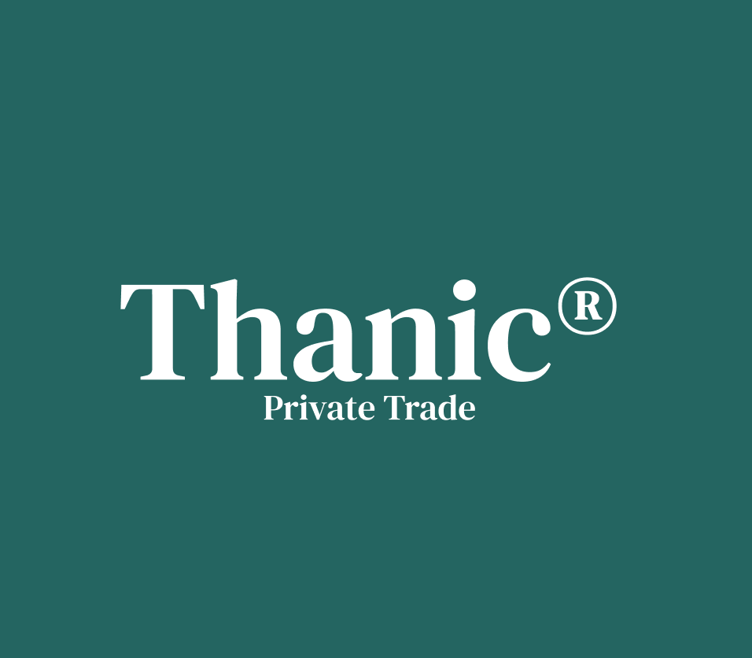
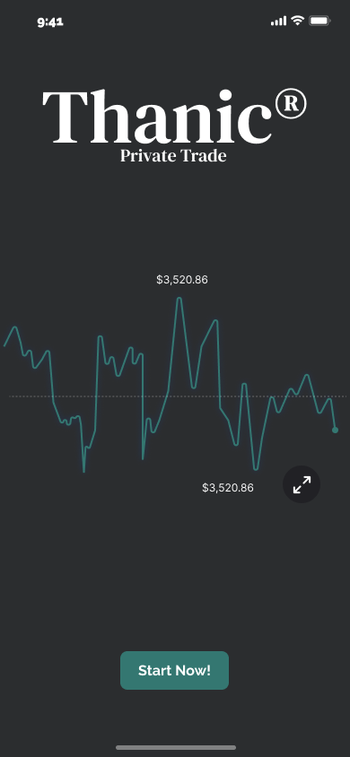

<!-- PROJECT LOGO -->
 

  

  <h3 align="center">Thanic APP</h3>

  

    Secure & Private Trade
  

<!-- TABLE OF CONTENTS -->

  
Table of Contents

  <ol>
    <li>
      <a href="#about-the-project">About The Project</a>
      <ul>
        <li><a href="#built-with">Built With</a></li>
      </ul>
    </li>
    <li>
      <a href="#getting-started">Getting Started</a>
      <ul>
        <li><a href="#prerequisites">Prerequisites</a></li>
        <li><a href="#installation">Installation</a></li>
      </ul>
    </li>
    <li><a href="#usage">Usage</a></li>
    <li><a href="#roadmap">Roadmap</a></li>
    <li><a href="#contributing">Contributing</a></li>
    <li><a href="#license">License</a></li>
    <li><a href="#contact">Contact</a></li>
    <li><a href="#acknowledgments">Acknowledgments</a></li>
  </ol>

<!-- ABOUT THE PROJECT -->
## About The Project

Thanic is made up of a group of five 19-year-olds. Lifelong friends and from the same town, now due to personal circumstances, one of them lives in Amersfoort (Netherlands) and another of them in Bilbao. Despite this, they face the challenge of carrying out this project with great enthusiasm.

The idea originated on a summer Friday as one more conversation, but we soon realized its potential. In September of that same year, they began to organize in a more serious way, recruiting the people who were going to be part of the project. And at the end of that month the first general meeting was held. At the end of 2021, the ideas will be finalized and the foundations for Thanic will begin to be laid, so that operations will begin in 2022. Aiming to release an alpha version of the application before February.

(<a href="#top">back to top</a>)

### Built With

This section should list any major frameworks/libraries used to bootstrap your project. Leave any add-ons/plugins for the acknowledgements section. Here are a few examples.

* [Next.js](https://nextjs.org/)
* [React.js](https://reactjs.org/)
* [Bootstrap](https://getbootstrap.com)
* [Solana](https://solana.com/)

(<a href="#top">back to top</a>)

<!-- GETTING STARTED -->
## Getting Started

This is an example of how you may give instructions on setting up your project locally.
To get a local copy up and running follow these simple example steps.

<!-- ROADMAP -->
## Roadmap

Today the first materialization of the project begins, starting the creation of the explanatory web page of the project as well as the creation of the project on github and its first dissemination. 
### Roadmap:

- [x] Project creation on ** Github ** ([https://github.com/Thanic-app/Thanic](url))
- [ ] Website design and programming
- [ ] Elaboration of ** base document ** that will be transferred to the design
- [ ] Creation of social networks (As well as ** base content **)

(<a href="#top">back to top</a>)

<!-- LICENSE -->
## License

Distributed under the MIT License. See `LICENSE.txt` for more information.

(<a href="#top">back to top</a>)

<!-- CONTACT -->
## Contact

Jon García Agramonte - [@Jon García Agramonte](https://www.instagram.com/jontafalla_/) - jon.agramonte@opendeusto.es

(<a href="#top">back to top</a>)

