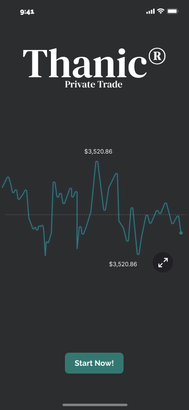

<div align="center">
<a href="https://github.com/Thanic-app/Thanic/">
    
  </a>
</div>

Thanic is made up of a group of five 19-year-olds. Lifelong friends and from the same town, now due to personal circumstances, one of them lives in Amersfoort (Netherlands) and another of them in Bilbao. Despite this, they face the challenge of carrying out this project with great enthusiasm.

The idea originated on a summer Friday as one more conversation, but we soon realized its potential. In September of that same year, they began to organize in a more serious way, recruiting the people who were going to be part of the project. And at the end of that month the first general meeting was held. At the end of 2021, the ideas will be finalized and the foundations for Thanic will begin to be laid, so that operations will begin in 2022. Aiming to release an alpha version of the application before February.

### Markdown

Markdown is a lightweight and easy-to-use syntax for styling your writing. It includes conventions for

```markdown
Syntax highlighted code block

# Header 1
## Header 2
### Header 3

- Bulleted
- List

1. Numbered
2. List

**Bold** and _Italic_ and `Code` text

[Link](url) and 
```

For more details see [GitHub Flavored Markdown](https://guides.github.com/features/mastering-markdown/).

### Jekyll Themes

Your Pages site will use the layout and styles from the Jekyll theme you have selected in your [repository settings](https://github.com/Thanic-app/Thanic/settings/pages). The name of this theme is saved in the Jekyll `_config.yml` configuration file.

### Support or Contact

Having trouble with Pages? Check out our [documentation](https://docs.github.com/categories/github-pages-basics/) or [contact support](https://support.github.com/contact) and we’ll help you sort it out.
